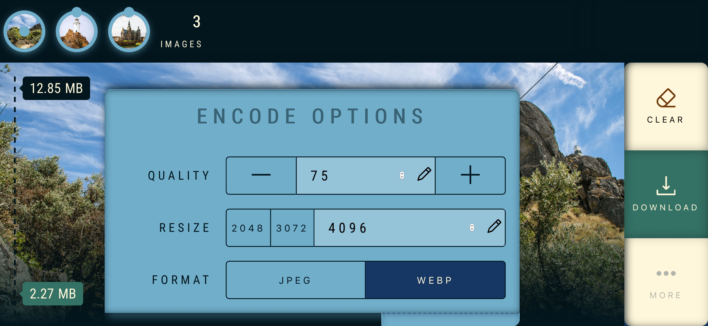

<div align="center">
  
  <br />
  <h1><a href="https://compressor.sascha.app/" rel="noopener noreferrer">Image Compressor</a></h1>
  <strong>A WebAssembly-powered website to decode/encode images. 🖼</strong>
  <br />
  <br />
  <a href="https://app.netlify.com/sites/upload-vorchdorf-media/deploys"></a>   
  <br />
  <br />
  <br />
</div>

## About

Image Compressor is a pure frontend-only [Progressive Web App](https://web.dev/progressive-web-apps/), realized using [Nuxt.js](https://nuxtjs.org/), [WebAssembly](https://webassembly.org/) and Web Workers.

It's also working offline and offers the same look and feel as a native app, when installed locally using Chrome, Android or iOS.

### Privacy

Images uploaded to the website will never leave your browser (unless downloaded), as there is no backend involved. Also, no tracking cookies are set. Your data remains your data and nothing else. Promise. 🙏

### Technology

Currently the following image codecs are supported:

- **image/jpeg**: JPEG decoding/encoding, EXIF extraction, wherever possible
- **image/webp**: WebP decoding/encoding

### UI Preview

<div align="center">
  
</div>

## Build Setup

```bash
# install dependencies
$ yarn install

# serve with hot reload at localhost:3000
$ yarn dev

# build for production and launch server
$ yarn build
$ yarn start

# generate static project
$ yarn generate
```

For detailed explanation on how things work, check out [Nuxt.js docs](https://nuxtjs.org).

## Contribution

This is very much a hacky project and could use some formatting-, testing- and documentation love. Feel free to reach out, if you're interested.

## License

Licensed under the MIT license.

Copyright ©️ 2020 [Sascha Zarhuber](https://sascha.work)
